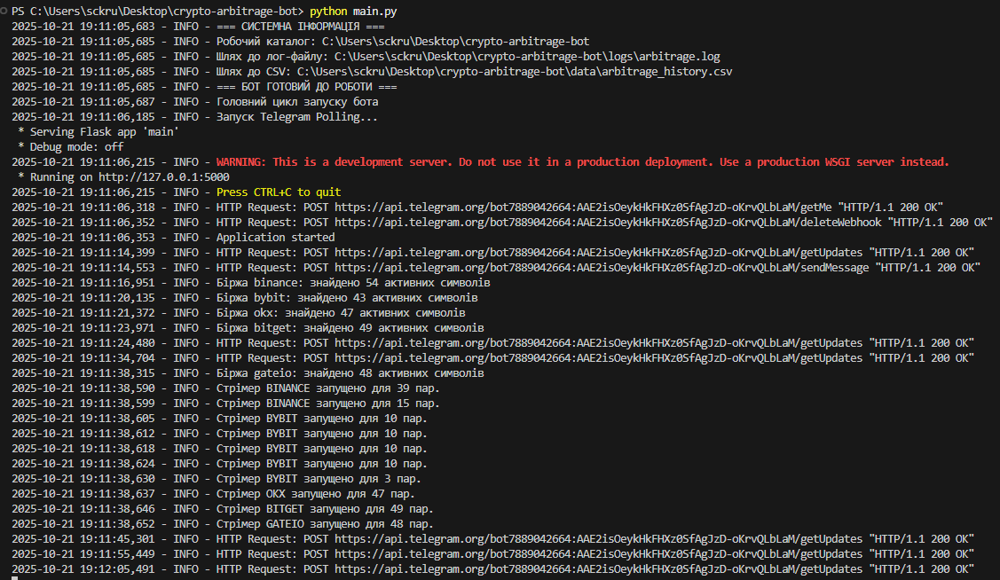
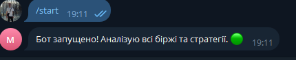
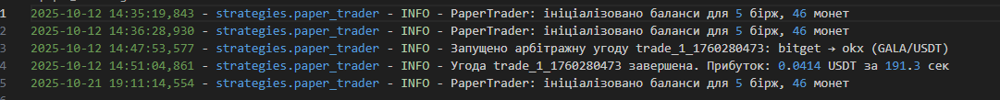

# Crypto Arbitrage Bot

Real-time Python bot for detecting and simulating crypto arbitrage opportunities across 5 exchanges (Binance, Bybit, OKX, Bitget, Gate.io). Uses CCXT.pro for WebSockets, supports cross-exchange, triangular, spot-futures, and volume-weighted strategies. Includes paper trading with leverage, fees, slippage simulation, Telegram bot for controls/alerts, and Flask dashboard for history visualization.

## Key Features
- **Strategies**:
  - Cross-Exchange: Buy low/sell high between exchanges.
  - Triangular: Cycle trades on single exchange (e.g., BTC-ETH-USDT).
  - Spot-Futures: Exploit basis (contango/backwardation).
  - Volume-Weighted: Accounts for liquidity in spreads.
- **Paper Trading**: Simulates full cycle (buy 5s, sell 5s, withdraw 120s) with balances per exchange/coin, 10x leverage, commissions/slippage.
- **Real-Time Data**: Async WebSocket streaming, symbol unification, price caching.
- **Integration**: Telegram commands (/start, /stop, /set_profit, /history, /balance); alerts with HTML formatting.
- **Dashboard**: Flask app with Plotly charts for arbitrage history (CSV data).
- **Configurable**: Profit threshold (0.002%), min volume ($5000), deposit ($100), exchange fees.

## Architecture Diagram
Telegram Bot --> Commands & Alerts
|
v
Main.py (Flask Dashboard + Async Loop)
|
v
Arbitrage.py (WebSockets + Price Cache)
|
+--> Strategies Folder (Cross/Triangular/etc.)
|
v
Paper Trader (Simulate Trades + Logs/CSV)
text## Setup & Usage
1. Clone: `git clone`
2. Install: `pip install -r requirements.txt`
3. Configure: Copy `.env.example` to `.env`, add API keys/Telegram token.
4. Run: `python main.py`
   - Telegram: Send /start to begin scanning.
- Customize: Edit config.py for symbols/thresholds.

## Demo

## Limitations & Next Steps
- Paper trading only (no live trades); add live mode with risk warnings.
- Optimized for education; for production, use VPS near exchanges for low latency.

## Contact
Text-only communication (no calls/video). Email: [sckrudji@gmail.com]